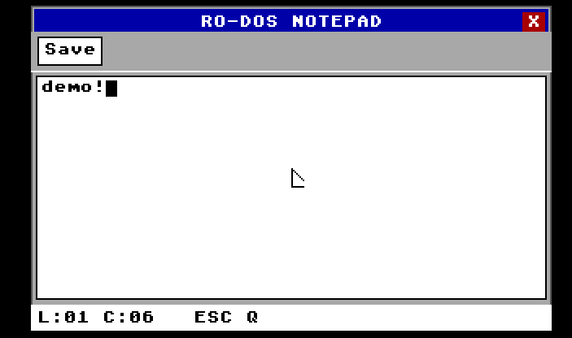
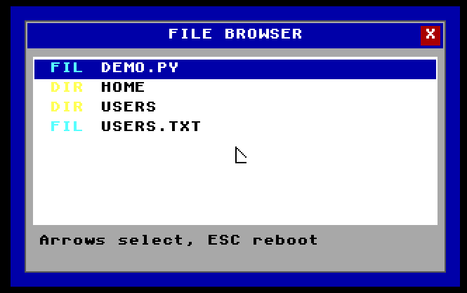
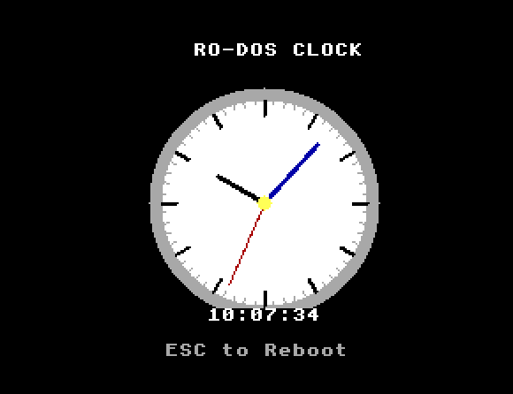
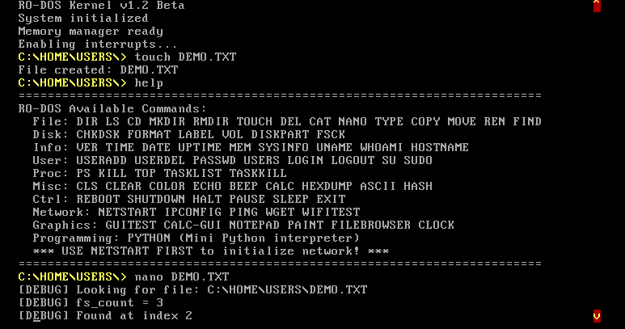
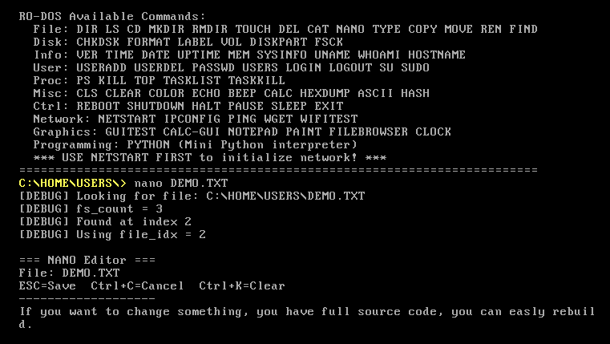

# RO-DOS v1.2 Beta - Retro-Disk Operating System

## Current Status & Known Issues (v1.2 Beta)

**Status:** v1.2 Beta includes a new Graphical User Interface (GUI)!

**Known Bugs:**
- **Mouse Support**: Experimental; works in some contexts, but behavior can be erratic or inconsistent.
- **ESC Key**: Functionality is inconsistent. It works in some applications but does **NOT** work in the File Browser.

> **Developer Note:** The developer is working hard to fix these bugs. We recommend waiting for the full Release for a stable experience.

## Gallery







**RO-DOS** (Retro-Disk Operating System) is a 32-bit protected mode operating system written in x86 assembly and C, designed to provide a nostalgic DOS-like command-line experience with modern protected mode features.

## Project Overview

RO-DOS is a hobby operating system project that combines:
- **Custom bootloader** - Loads kernel from disk into memory
- **32-bit protected mode kernel** - Modern CPU features with retro aesthetics
- **Memory management** - Dynamic allocation with MCB-based heap
- **File system support** - FAT12-compatible disk operations
- **Shell with 100+ commands** - Comprehensive command-line interface
- **Hardware abstraction** - Direct hardware access with clean API

### Key Features

**System Features**
- 32-bit protected mode execution
- Custom interrupt descriptor table (IDT)
- Hardware interrupt handling (timer, keyboard)
- Memory manager with malloc/free
- Real-time clock (RTC) integration
- System call interface (INT 0x80)

**File System**
- FAT12 filesystem support
- Directory operations (DIR, CD, MD, RD)
- File operations (COPY, DEL, REN, TYPE)
- Disk utilities (FORMAT, CHKDSK, FDISK)

**User Interface**
- VGA text mode (80x25)
- Hardware cursor support
- Color customization
- Command history
- 100+ built-in commands

## System Requirements

### Development Environment

- **Operating System**: Linux (Ubuntu recommended), Windows with WSL, or macOS
- **CPU**: x86 or x86_64 processor with virtualization support
- **RAM**: 2GB minimum (for development tools and emulator)
- **Disk**: 500MB free space

### Required Tools

- NASM (Netwide Assembler) - v2.14+
- GCC (GNU Compiler Collection) - v7.0+
- GNU Make - v4.0+
- QEMU (Quick Emulator) - v4.0+
- genisoimage or mkisofs (for ISO creation)

## Installation Instructions

### Linux (Ubuntu/Debian)

```bash
# Update package lists
sudo apt update

# Install build tools
sudo apt install -y build-essential nasm gcc make binutils

# Install QEMU emulator
sudo apt install -y qemu-system-x86

# Install ISO creation tools
sudo apt install -y genisoimage

# Verify installations
nasm -v
gcc --version
make --version
qemu-system-i386 --version
```

### Linux (Fedora/RHEL/CentOS)

```bash
# Install build tools
sudo dnf install -y nasm gcc make binutils

# Install QEMU
sudo dnf install -y qemu-system-x86

# Install ISO tools
sudo dnf install -y genisoimage

# Verify installations
nasm -v
gcc --version
qemu-system-i386 --version
```

### Linux (Arch Linux)

```bash
# Install build tools
sudo pacman -S nasm gcc make binutils

# Install QEMU
sudo pacman -S qemu-system-x86

# Install ISO tools
sudo pacman -S cdrtools

# Verify installations
nasm -v
gcc --version
qemu-system-i386 --version
```

### Windows (WSL2 - Recommended)

**Step 1: Install WSL2**

```powershell
# Run in PowerShell as Administrator
wsl --install -d Ubuntu-24.04

# Restart your computer
```

**Step 2: Install Development Tools in WSL**

```bash
# Update Ubuntu
sudo apt update && sudo apt upgrade -y

# Install build essentials
sudo apt install -y build-essential nasm gcc make binutils

# Install QEMU
sudo apt install -y qemu-system-x86

# Install ISO tools
sudo apt install -y genisoimage

# Verify installations
nasm -v
gcc --version
qemu-system-i386 --version
```

**Step 3: Configure WSL for GUI (Optional - for QEMU window)**

```bash
# Install X Server (VcXsrv or Xming on Windows)
# Then set display in WSL:
echo "export DISPLAY=:0" >> ~/.bashrc
source ~/.bashrc
```

### macOS

**Step 1: Install Homebrew** (if not already installed)

```bash
/bin/bash -c "$(curl -fsSL https://raw.githubusercontent.com/Homebrew/install/HEAD/install.sh)"
```

**Step 2: Install Development Tools**

```bash
# Install NASM
brew install nasm

# Install GCC (if not using Xcode)
brew install gcc

# Install QEMU
brew install qemu

# Install ISO tools
brew install cdrtools

# Install GNU Make (macOS has BSD make)
brew install make

# Verify installations
nasm -v
gcc --version
qemu-system-i386 --version
```

**Step 3: Add Homebrew tools to PATH** (if needed)

```bash
echo 'export PATH="/usr/local/opt/make/libexec/gnubin:$PATH"' >> ~/.zshrc
source ~/.zshrc
```

### Troubleshooting Installation

**NASM not found:**
```bash
# Check if NASM is installed
which nasm

# If not found, install manually:
# Download from: https://www.nasm.us/
# Or use package manager as shown above
```

**GCC not found:**
```bash
# Linux: Install build-essential
sudo apt install build-essential

# macOS: Install Xcode Command Line Tools
xcode-select --install
```

**QEMU not working:**
```bash
# Check QEMU installation
qemu-system-i386 --version

# If missing, reinstall:
# Linux: sudo apt install qemu-system-x86
# macOS: brew install qemu
# Windows WSL: sudo apt install qemu-system-x86
```

## Quick Start

### Building RO-DOS

```bash
# Clone or download the repository
cd RO-DOS

# Clean previous builds
make clean

# Build the complete system
make all

# This creates:
# - build/bootload.bin (bootloader)
# - build/kernel.bin (kernel)
# - build/rodos.img (floppy image)
# - build/rodos.iso (ISO image)
```

### Running RO-DOS

**Option 1: Run with Floppy Image**
```bash
make run
```

**Option 2: Run with ISO Image**
```bash
make run-iso
```

**Option 3: Run with Debug Options**
```bash
make run-debug
```

**Option 4: Run in Terminal Mode** (no GUI)
```bash
make run-curses
```

### Build Targets

```bash
make all          # Build complete system (default)
make clean        # Remove all build artifacts
make rebuild      # Clean and rebuild
make run          # Build and run in QEMU (floppy)
make run-iso      # Build and run in QEMU (ISO)
make run-debug    # Run with CPU debug output
make info         # Display build information
make help         # Show all available targets
```

## Project Structure

```
RO-DOS/
├── src/                    # Source code
│   ├── bootload.asm       # Bootloader (512 bytes)
│   ├── kernel.asm         # Kernel entry and initialization
│   ├── memory.asm         # Memory management (malloc/free)
│   ├── filesys.asm        # FAT12 filesystem
│   ├── io.asm             # VGA text mode & keyboard
│   ├── interrupt.asm      # IDT and IRQ handlers
│   ├── vesa.asm           # VESA BIOS Extensions handler
│   ├── handlers.c         # Interrupt handlers (C)
│   ├── shell.c            # Command shell
│   ├── commands.c         # Built-in commands (100+)
│   ├── syscall.c          # System call interface
│   ├── utils.c            # Utility functions
│   ├── utils.h            # Utility headers
│   ├── pci.c              # PCI bus driver
│   ├── pci.h              # PCI definitions
│   ├── scrollback.c       # Terminal scrollback buffer
│   ├── scrollback.h       # Scrollback header
│   ├── gui_apps.c         # GUI Applications (Notepad, Paint, etc.)
│   ├── gui_calc.c         # GUI Calculator logic
│   ├── firmware_loader.c  # Firmware loading mechanism
│   ├── rust_driver_stubs.c # Adapter for Rust drivers (legacy/stub)
│   ├── cmd_netmode.c      # Network mode command
│   ├── network_interface.c # Network interface layer
│   ├── tcp_ip_stack.c     # TCP/IP implementation
│   ├── dhcp_client.c      # DHCP client
│   ├── wifi_autostart.c   # WiFi initialization
│   ├── wifi_autostart.h   # WiFi header
│   └── drivers/           # Hardware Drivers
│       ├── mouse.c        # PS/2 Mouse Driver
│       ├── mouse.h        # Mouse header
│       ├── ata.c          # ATA/IDE Disk Driver
│       ├── ne2000.c       # NE2000 Network Driver
│       └── vbe_graphics.c # VBE Graphics Driver
│
├── include/               # Header files
│   ├── stdint.h           # Fixed-width integer types
│   ├── stddef.h           # Standard definitions
│   ├── stdbool.h          # Boolean type
│   ├── firmware.h         # Firmware definitions
│   ├── network.h          # Network definitions
│   └── portio.h           # I/O port definitions
│
├── build/                 # Build output (generated)
│   ├── bootload.bin       # Compiled bootloader
│   ├── kernel.bin         # Compiled kernel
│   ├── rodos.img          # Bootable disk image
│   ├── rodos.iso          # Bootable ISO image
│   └── obj/               # Object files
│
├── assets/                # Images and media
│   ├── 0.png              # Screenshot 0 (Notepad)
│   ├── 1.png              # Screenshot 1 (File Browser)
│   ├── 2.png              # Screenshot 2 (Clock)
│   ├── 3.png              # Screenshot 3 (Usage)
│   └── 4.png              # Screenshot 4 (Usage)
│
├── link.ld                # Linker script
├── Makefile               # Build configuration
├── run.sh                 # Quick build & run script
└── README.md              # This file

```

## Using RO-DOS

### Basic Commands

```bash
# System Information
VER                 # Display version
MEM                 # Show memory statistics
TIME                # Display current time
DATE                # Display current date
WHOAMI              # Show current user

# File System
DIR                 # List directory contents
CD <path>           # Change directory
MD <name>           # Make directory
RD <name>           # Remove directory
TYPE <file>         # Display file contents
COPY <src> <dst>    # Copy file
DEL <file>          # Delete file
REN <old> <new>     # Rename file

# Disk Operations
CHKDSK              # Check disk for errors
FORMAT <drive>      # Format disk
FDISK               # Partition management
LABEL <name>        # Set volume label

# System Control
CLS                 # Clear screen
COLOR <attr>        # Set screen colors
BEEP <freq> <ms>    # Generate beep
REBOOT              # Restart system
SHUTDOWN            # Power off system

# Help
HELP                # Show all commands
<command> /?        # Show command help
```

### Advanced Features

**Process Management:**
```bash
PS                  # List running processes
KILL <pid>          # Terminate process
RUN <program>       # Execute program
NICE <pid> <prio>   # Set process priority
```

**Network Commands:** (simulated)
```bash
PING <host>         # Test connectivity
IPCONFIG            # Network configuration
TRACERT <host>      # Trace route
NETSTAT             # Network statistics
```

**Hardware Information:**
```bash
BIOS                # Display BIOS info
DRIVER              # List loaded drivers
IRQ                 # Show IRQ assignments
USB                 # List USB devices
```

## Architecture Overview

### Boot Process

1. **BIOS** loads bootloader from sector 0 to 0x7C00
2. **Bootloader** (bootload.asm):
   - Loads kernel from disk sectors
   - Enables A20 gate
   - Sets up GDT for protected mode
   - Jumps to kernel entry at 0x10000

3. **Kernel** (kernel.asm):
   - Initializes IDT and PIC
   - Sets up memory manager
   - Initializes I/O subsystem
   - Starts shell

### Memory Layout

```
0x00000000 - 0x000003FF : IVT (Interrupt Vector Table)
0x00000400 - 0x000004FF : BIOS Data Area
0x00000500 - 0x00007BFF : Free conventional memory
0x00007C00 - 0x00007DFF : Bootloader (512 bytes)
0x00010000 - 0x0008FFFF : Kernel code & data
0x00090000 - 0x0009FFFF : Kernel stack
0x00100000 - 0x003FFFFF : Extended memory / heap
0x000A0000 - 0x000BFFFF : VGA text mode buffer (0xB8000)
0x000C0000 - 0x000FFFFF : BIOS ROM
```

### Interrupt Handling

- **IRQ 0 (INT 0x20)**: Timer interrupt (18.2 Hz)
- **IRQ 1 (INT 0x21)**: Keyboard interrupt
- **INT 0x80**: System call interface
- **INT 0x00-0x1F**: CPU exceptions

### System Calls

RO-DOS provides a UNIX-like system call interface through `INT 0x80`:

| System Call | Number | Description |
|-------------|--------|-------------|
| SYS_PRINT_STRING | 0x01 | Print string to console |
| SYS_READ_CHAR | 0x04 | Read character from keyboard |
| SYS_CLEAR_SCREEN | 0x05 | Clear screen |
| SYS_GET_TIME | 0x50 | Get current time from RTC |
| SYS_GET_DATE | 0x51 | Get current date from RTC |
| SYS_GETPID | 0x44 | Get process ID |
| SYS_SYSINFO | 0x54 | Get system information |
| SYS_READ_SECTOR | 0x61 | Read disk sector |

## Testing & Debugging

### Debug Build

```bash
# Build with debug symbols
make run-debug

# QEMU will output CPU state on exceptions
```

### Hex Dumps

```bash
# Dump bootloader
make dump-boot

# Dump kernel
make dump-kernel
```

### GDB Debugging

```bash
# Start QEMU with GDB server
qemu-system-i386 -drive file=build/rodos.img,if=floppy,format=raw \
    -boot a -s -S

# In another terminal, connect GDB
gdb
(gdb) target remote localhost:1234
(gdb) break *0x7c00
(gdb) continue
```

### Common Issues

**Bootloader not loading:**
- Verify bootloader is exactly 512 bytes
- Check boot signature (0xAA55 at offset 510-511)
- Use `make dump-boot` to inspect

**Kernel crashes on start:**
- Check memory layout in link.ld
- Verify GDT entries in bootloader
- Use `make run-debug` for CPU state

**Commands not working:**
- Check shell input handling
- Verify command dispatcher in commands.c
- Add debug output to trace execution

## Documentation

- [Makefile](Makefile) - Build system documentation (inline comments)
- Source code contains extensive inline comments

## Contributing

This is a personal educational project, but feedback and suggestions are welcome!

### Development Guidelines

1. Follow existing code style
2. Comment assembly code thoroughly
3. Keep C code freestanding (no libc dependencies)
4. Test in QEMU before committing
5. Update documentation for new features

## License

This project is released under the MIT License.

```
Copyright (c) 2026 Luka

Permission is hereby granted, free of charge, to any person obtaining a copy
of this software and associated documentation files (the "Software"), to deal
in the Software without restriction, including without limitation the rights
to use, copy, modify, merge, publish, distribute, sublicense, and/or sell
copies of the Software, and to permit persons to whom the Software is
furnished to do so, subject to the following conditions:

The above copyright notice and this permission notice shall be included in all
copies or substantial portions of the Software.

THE SOFTWARE IS PROVIDED "AS IS", WITHOUT WARRANTY OF ANY KIND, EXPRESS OR
IMPLIED, INCLUDING BUT NOT LIMITED TO THE WARRANTIES OF MERCHANTABILITY,
FITNESS FOR A PARTICULAR PURPOSE AND NONINFRINGEMENT. IN NO EVENT SHALL THE
AUTHORS OR COPYRIGHT HOLDERS BE LIABLE FOR ANY CLAIM, DAMAGES OR OTHER
LIABILITY, WHETHER IN AN ACTION OF CONTRACT, TORT OR OTHERWISE, ARISING FROM,
OUT OF OR IN CONNECTION WITH THE SOFTWARE OR THE USE OR OTHER DEALINGS IN THE
SOFTWARE.
```

## Acknowledgments

- OSDev Community for x86 architecture resources
- NASM Documentation for assembly reference
- QEMU Project for emulation platform
- DOS heritage and retro computing community

---

**RO-DOS** - *Bringing retro computing into the modern age*

Built with love using x86 Assembly and C